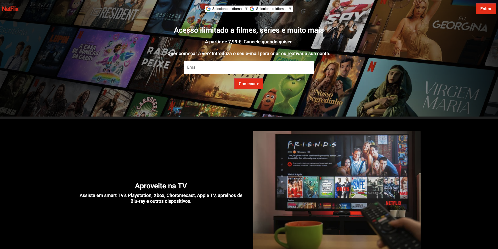

```markdown
# 🎬 Clone da Netflix — Projeto Frontend com API de Filmes

Este projeto é um clone visual da página inicial da Netflix, desenvolvido com foco em front-end moderno e consumo de API externa. Utiliza HTML, CSS, JavaScript e Bootstrap para criar uma interface responsiva e dinâmica, integrando a [API do The Movie Database (TMDB)](https://api.themoviedb.org/3/discover/movie) para exibir filmes reais.

---

## 🚀 Funcionalidades

- Interface inspirada na Netflix Brasil
- Consumo da API TMDB para listar filmes em tempo real
- Layout responsivo com Bootstrap
- Efeitos visuais e interações com JavaScript
- Campos de entrada e botões simulando a experiência de assinatura
- Seções promocionais como "Aproveite na TV" e "Assista onde quiser"

---

## 🧱 Estrutura do Projeto


netflix-clone/
├── index.html           # Página principal
├── style.css            # Estilos personalizados
├── script.js            # Lógica de consumo da API e interações
├── assets/              # Imagens e ícones usados no layout
└── README.md            # Documentação do projeto
```

---

## 🛠️ Tecnologias Utilizadas

- HTML5
- CSS3
- JavaScript (ES6)
- Bootstrap 5
- [TMDB API](https://www.themoviedb.org/documentation/api)

---

## 🔑 Como usar a API do TMDB

1. Crie uma conta gratuita em [https://www.themoviedb.org](https://www.themoviedb.org)
2. Gere sua chave de API
3. No arquivo `script.js`, substitua:

```javascript
const API_KEY = 'SUA_CHAVE_AQUI';
```

---

## 📦 Como executar o projeto

1. Clone o repositório:

```bash
git clone https://github.com/WeslleySoaresm/netflix-clone.git
cd netflix-clone
```

2. Abra o arquivo `index.html` no navegador:

```bash
start index.html
```

> Ou simplesmente arraste o arquivo para o navegador.

---

## 📸 Preview



---

## 📌 Autor

Desenvolvido por **Weslley Soares** como parte de um projeto de prática em front-end e integração com APIs públicas.


